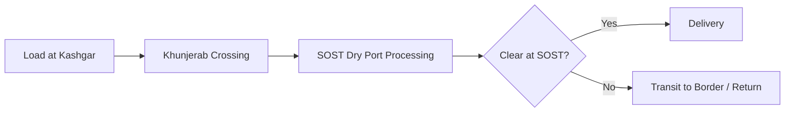
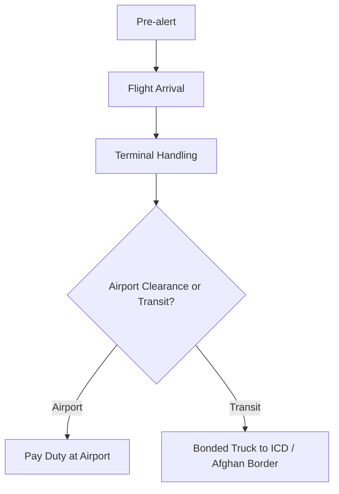

# Process Flows (Mermaid)

Below are the process flow diagrams for core workflows. You can render these with any Mermaid-enabled viewer.

## 1) Container Ship (Maritime) — Standard

```mermaid
flowchart TD
  A[Origin Port Booking] --> B[Pre-Arrival: PAD to PSW (72h)]
  B --> C[Vessel Arrival & Discharge]
  C --> D[Bay-plan Reconciliation]
  D --> E{Transhipment?}
  E -- No --> F[Port Clearance]
  F --> G[Duty Paid / Full Clearance at Port]
  G --> H[Domestic Movement -> ICD / Consignee]
  E -- Yes --> I[Move to Transhipment Yard]
  I --> J[Assign Bonded Truck (BSR)]
  J --> K[Transit Manifest -> PSW]
  K --> L[Cross Border / Afghan Transit Leg]
  L --> M[Return to Pakistan ICD or Consignee]
```

## 2) Afghan Transhipment via Karachi (Chapter XXV)

```mermaid
flowchart LR
  subgraph Maritime
    A1[Booking & B/L] --> A2[PAD->PSW]
    A2 --> A3[Vessel Arrival & Discharge]
    A3 --> A4[Port Clearance under Transit Bond]
  end
  A4 --> B1[Move to Afghan-bound Yard]
  subgraph TransitLeg
    B1 --> B2[Customs Exam?]
    B2 --> B3[Assign BSR Truck]
    B3 --> B4[Transit Manifest (PSW)]
    B4 --> B5[Exit Port -> Border]
  end
  B5 --> C1[Afghan Entry (Temporary Import)]
  C1 --> C2[Afghan Clearance] --> C3[Load Pakistan-bound Truck]
  C3 --> C4[Re-entry to Pakistan Border]
  C4 --> C5[Verify vs Original Transit Bond] --> C6[Move to Final Pakistan ICD]
```

## 3) Trucking (Road Freight) — Cross-Border Example (KKH)



## 4) Air Freight (Standard)



## 5) Dual Duty Workflows

### Workflow A: Duty Payment at First Port

```mermaid
flowchart TD
  A[Arrival & GD via PSW] --> B[Valuation & HS checks]
  B --> C[Duty Assessment]
  C --> D[PSID & Payment]
  D --> E[Examination (optional)]
  E --> F[OOC & Release]
  F --> G[Domestic Movement]
```

### Workflow B: Transit to ICD (Chapter XXV)

```mermaid
flowchart TD
  X[Arrival & Transit Declaration (PSW)] --> Y[Bond Calculation & Submission]
  Y --> Z[Seal & Transit Pass]
  Z --> T[In-Transit (GPS + Border Records)]
  T --> U[Arrival at ICD]
  U --> V[Final Goods Declaration & Duty Payment]
  V --> W[Clearance & Delivery]
```
